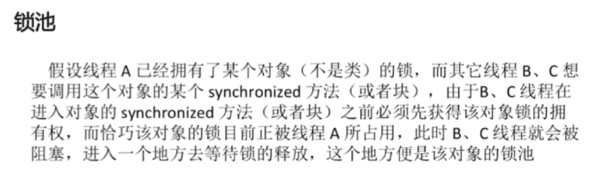

# java多线程与并发

## 进程与线程的区别

 进程是资源分配的最小单元，线程是cpu调度的最小单元

- 所有与进程相关的资源，都被记录在pcb中
- 进程是抢占处理器的调度单位；线程属于某个进程，共享其资源
- 线程只由堆栈寄存器，程序计数器和tcb组成

总结

- 线程不能看作独立应用，而进程可看作独立应用
- 进程有独立的地址空间，相互不影响，线程只是进程的不同执行路径
- 线程没有独立的地址空间，多进程的程序比多线程程序健壮
- 进程的切换比线程的切换开销大

// todo

## 进程和线程的由来

1. 串行：初期的计算机只能串行执行任务，并且需要长时间等待用户输入
2. 批处理：预先将用户的指令集中成清单，批量串行处理用户指令，任然无法并发执行
3. 进程：进程独占内存空间，保存各自运行状态，相互间不干扰且可以互相切换，并未并发处理任务提供了可能
4. 线程：共享进程的内存资源，相互间切换更快速，支持更细粒度的任务控制，使进程内的子任务得以并发执行

## java进程和线程的关系

- java对操作系统提供的功能进行封装，包括进程和线程
- 运行一个程序会产生一个进程，进程包含至少一个线程
- 每个进程对应一个jvm实例，多个线程共享jvm里的堆
- java采用单线程编程模型，程序会自动创建主线程
- 主线程可以创建子线程，原则上要后于子线程完成执行

## Thread中start()与run()的区别

- 调用start()方法会创建一个新的子线程并启动
- run()方法只是Thread的一个普通方法的调用

## Thread和Runnable是什么关系

- Thread是实现了Runable接口的类，使得run支持多线程
- 因类的单一继承原则，推荐多使用Runnable接口

## 如何给run()方法传参

- 构造函数传参
- 成员变量传参
- 回调函数传参

## 如何实现处理线程的返回值

- 主线程等待法
- 使用Thread类的join()阻塞当前线程以等待子线程处理完毕
- 通过Callable接口实现：通过FutureTask 或线程池获取

## 线程状态

- 新建 new : 创建后尚未启动的线程的状态
- 运行 Runnable ：包含Running 和 Ready
- 无限期等待 Waiting：不会被分配cpu执行时间，需要显示被唤醒
  - 没有设置Timeout参数的Object.wait()方法
  - 没有设置Timeout参数额Thread.join()方法
  - LockSupport.park()方法
- 限期等待 Timed Waiting ：在一定时间后会由系统自动唤醒
  - Thread.sleep()方法
  - 设置了Timeout参数的Object.wait()方法
  - 设置了Timeout参数额Thread.join()方法
  - LockSupport.parkNanos()方法
  - LockSupport.parkUtil()方法
- 阻塞 Blocked：等待获取排它锁
- 结束 Terminated：已终止线程的状态，线程已经结束执行

## sleep和wait的区别

### 基本差别

- sleep是Thread类的方法，wait是Object类中定义的方法
- sleep()防止可以在任何地方使用
- wait()方法只能在synchronized方法或synchronized块中使用

### 最主要的本质区别

- Thread.sleep只会让出cpu，不会导致锁行为的改变
- Object.wait不仅让出cpu，还会释放已经占用的同步资源锁

 ## notify与notifyAll的区别

### 两个概念

- 锁池

- 等待池

### 区别

- notifyAll会让所有处于等待池的线程全部进入锁池区竞争获取锁的机会
- notify只会随机选取一个处于等待池中的线程进入锁池区竞争获取锁的机会

## Yield

### 概念

当调用Thread.yield()函数时，会给线程调度器一个当前线程愿意让出CPU使用的暗示，但是线程调度器可能会忽略这个暗示。

## 如何中断线程

### 已经被抛弃的方法

- 调用stop() 方法停止线程
- 通过调用suspend()和resume()方法

### 目前使用的方法

- 调用interrupt(),通知线程应该中断了
  - 如果线程处于被阻塞状态，那么线程将立即退出被阻塞状态，并抛出一个InterruptedException异常。
  - 如果线程处于正常活动状态，那么会将该线程的终端标志设置为true,被设置为中断标志的线程将继续正常运行，不受影响。

需要被调用的线程配置中断

- 在正常运行任务时，经常检查本线程的中断标志位，如果被设置了中断标志就自行停止线程。
- 如果线程处于正常活动状态，那么会将该线程的中断标志设置为true.被设置中断标志的线程将继续正常运行，不受影响。